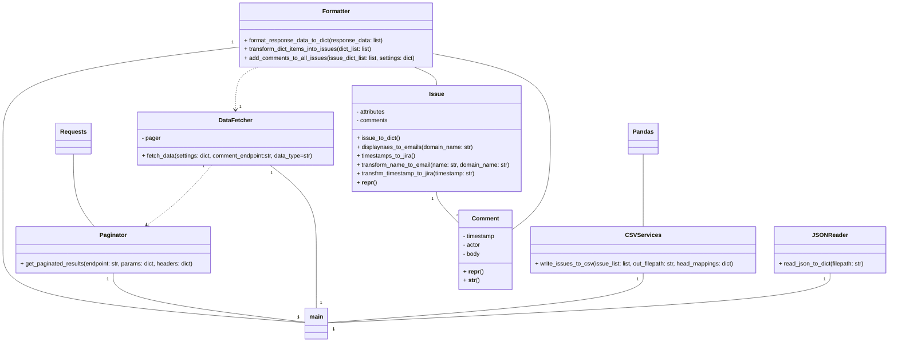

# Luokkakaavio #

```mermaid
 classDiagram
			JSONReader "1" -- "1" main
			CSVServices "1" -- "1" main
			DataFetcher "1" ..> "1" Paginator
			DataFetcher "1" -- "1" main
			Paginator "1" -- "1" main
			Formatter "1" ..> "1" DataFetcher
			Formatter "1" -- "1" main
		  Formatter -- Issue
		  Formatter -- Comment
		  Issue "1" -- "*" Comment
		  Pandas -- CSVServices
		  Requests -- Paginator
		 
		  class JSONReader{
		    + read_json_to_dict(filepath: str)
		  }
		  
		  class CSVServices {
		    + write_issues_to_csv(issue_list: list, out_filepath: str, head_mappings: dict)
		  }
		  
		  class DataFetcher {
		  	 - pager
		    + fetch_data(settings: dict, comment_endpoint:str, data_type=str)
		  }
		  
		  class Paginator {
		    + get_paginated_results(endpoint: str, params: dict, headers: dict)
		  }
		  
		  class Formatter{
		    + format_response_data_to_dict(response_data: list)
			  + transform_dict_items_into_issues(dict_list: list)
			  + add_comments_to_all_issues(issue_dict_list: list, settings: dict)
		  }
		  
		  class Issue {
		    - attributes
				- comments
				+ issue_to_dict()
				+ displaynaes_to_emails(domain_name: str)
				+ timestamps_to_jira()
				+ transform_name_to_email(name: str, domain_name: str)
				+ transfrm_timestamp_to_jira(timestamp: str)
				+ __repr__()
		  }
		  
		  class Comment {
		    - timestamp
			  - actor
			  - body
			  + __repr__()
			  + __str__()
		  }
```