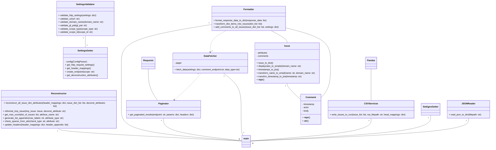
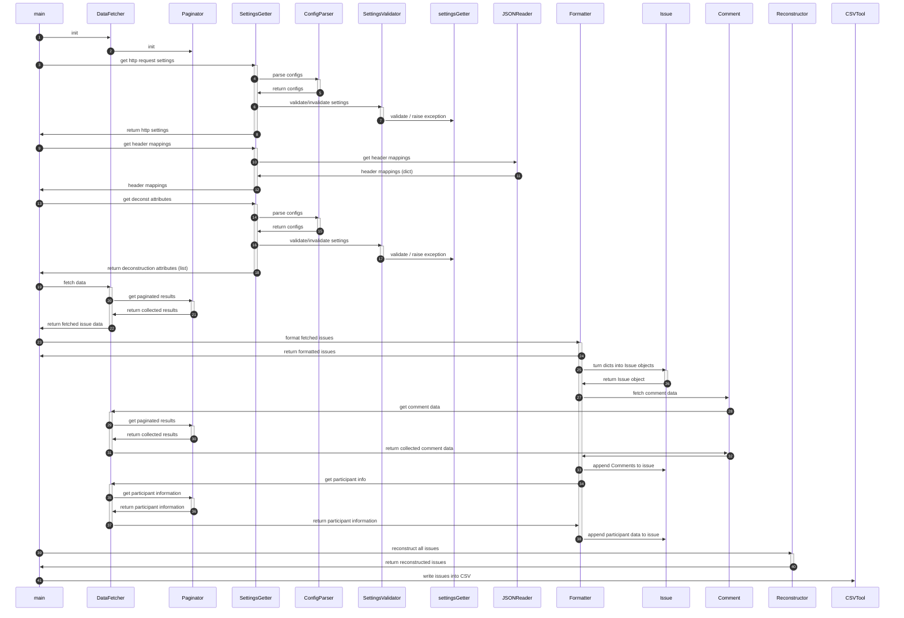

# Arkkitehtuurikuvaus #

## Rakenne ##
Ohjelman komponentit on jaettu kolmeen kategoriaan: entitites, services ja typing.

Entitites-kategorian komponentit mallintavat konkreettisia tietorakenteita kuten tässä tapauksessa Issueta ja Commentia.

Services-kategorian komponentit ovat ohjelman toiminnallisia komponentteja, jotka vastaavat ohjelman toimintalogiikasta.

Typing-kategorian komponentit tarjoavat tyypitustarkastamisen palveluita. Näitä käytetään esimerkiksi asetuksia varten, jotta palveluihin ei livahda väärän tyyppistä dataa.

Lisäksi ohjelmalla on kansio 'resources' joka sisältää ohjelman toimimiselle olennaisia resursseja.

## Käyttöliittymä ##
Sovellus on CLI-pohjainen. Kaikki asetukset säädetään config.cfg tai .env -tiedoston kautta.

## Käytetyt ulkoiset kirjastot ##
Sovellus hyödyntää seuraavia ulkopuolisia kirjastoja:
- Pandas
- Requests
- Typing
- Strongtyping

## Sovelluslogiikka ##
Sovelluksen bisneslogiikasta vastaavat seuraavat komponentit:
- JSONReader
- CSVServices
- DataFetcher
- Paginator
- Formatter
- Reconstructor
- SettingsGetter

Formatter-luokka hyödyntää komponentteja Issue ja Comment, jotka ovat objekteja, joiden tarkoitus on mallintaa käsiteltäviä entiteettejä, eli issueita ja komponentteja. Pakkauksen hakemistossa 'typesets' löytyvät ohjelman käyttävät tyypityksen validaattori, SettingsValidator, jolla pyritään varmistamaan, että ohjelmalle annetaan oikeassa muodossa oikean tyyppistä dataa suoritusta varten.

Ohjelam alustaa suorituksensa siten, että JSONReader noutaa `mapping.json` -tiedostosta asetukset sille kuinka GitLabin issueiden kentät mäpätään Jiran vastaaviin kenttiin.
Ohjelman suorituksen konfiguraatiot ovat config.cfg -tiedostossa. Ohjelman alkuun SettingsGetter-olio purkaa konfiguraatiotiedoston konfiguraatiot dictionary-formaattiin. SettingsValidator-moduuli vastaa asetusten validoinnista: asetuksien tyypitys tarkastetaan ja merkkijonomuotoiset syötteet tarkastetaan regexp-lausekkeita vasten. Jos syötteet ovat virheellisiä, nostaa validaatori errorin.
Seuraavaksi DataFetcher-oliolle annetaan noudettavan datan asetukset ja se kutsuu puolestaan Paginator-oliota, joka suorittaa varsinaiset HTTP-kyselyt, kyselyjen vastuasten sivuttamisen ja tulosten kokoamisen.
DataFetcher-olio palauttaa kootut tulokset dict-muodossa.
Formatter-olio käsittelee ensin palautetut tulokset muuttaen ne halutussa formaatissa oleviksi dicteiksi, jonka jälkeen em. dictit muutetaan Issue-luokan olioiksi, jotka palautetaan listana.
Lista annetaan Formatter-oliolle, joka poimii jokaisesta Issue-oliosta tiedon niihin liittyvien kommenttien URL:n sijainnista. Tieto annetaan DataFetcher-oliolle kautta Paginator-oliolle, joka hakee, sivuttaa ja kokoaa kaikki kommentit, jotka Formatter-olio liittää Issue-olioon.
Ennen tietojen kirjoittamista CSV-tiedostoon Reconstructor-olio purkaa määritellyt attribuutit (Labels, Comments ja/tai Watchers) niin, että jokaisen attribuutin listna alkiot siirretään omiin sarakkeisiinsa. Sarakkeet foramtoidaan niin, että niillä on kaikilla sama nimi.
Lopuksi ohjelma kirjoittaa pandas-kirjastoa hyödyntäen Issue-olioiden attribuutit CSV-tiedostoon.

## Luokkakaavio ##

## Ohjelman sekvenssikaavio ##

## Tietojen pysyväistallennus ##
Ohjelma hakee alkuun GitLabin REST API:sta halutun skoopin mukaisen datan ja ohjelman päätteeksi tuottaa artefaktina CSV-tiedoston, joka voidaan importoida Jiraan.

## Ohjelman rakenteelliset heikkoudet ##
- Issue-luokalle on delegoitu sellaisia vastuita, jotka saattaisivat paremmin kuulua Formatter-luokalle.
- Tyypityksen tarkastus on tällä hetkellä riittämätön.
- Testit Paginator.py:lle vaativat vielä hiomista, jotta ne nappaavat normaalit käyttötapaukset ja mahdolliset virhetapaukset.
- Noudetun datan muuntaminen HTTP-pyynnön palauttamasta datasta dictionaryksi on kovakoodattu Paginator.py'hyn. Kestävämpi ratkaisu olisi luoda erillinen tiedosto, johon voisi keskitetysti koota näidenkin asetukset.
