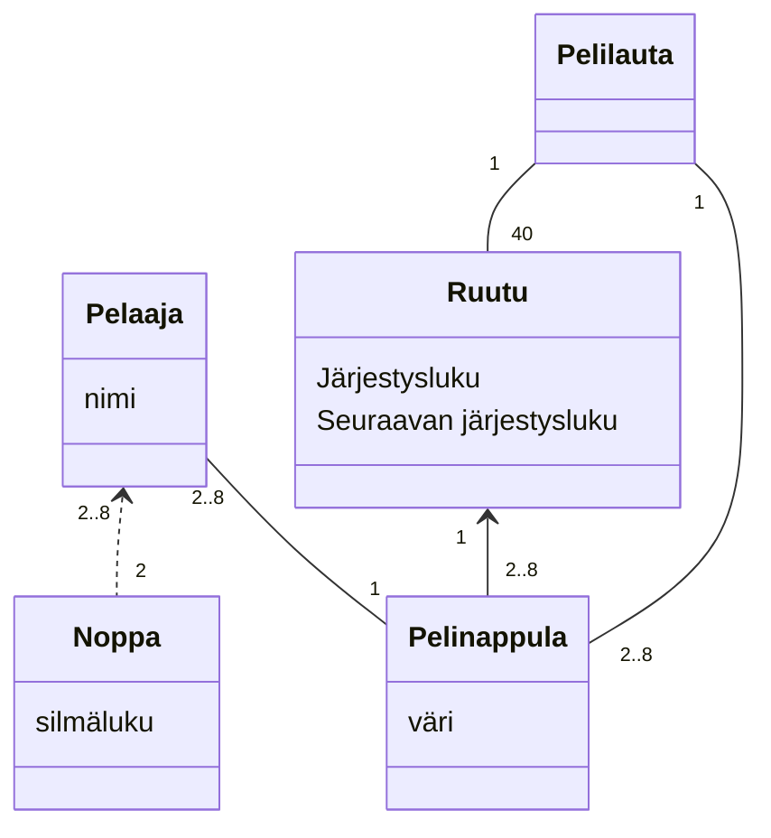

# Monopolin UML-mallinnus #

## Tehtävä 1 ##

### Vaatimukset ##
Monopolia pelataan käyttäen kahta noppaa. Pelaajia on vähintään 2 ja enintään 8. Peliä pelataan pelilaudalla joita on yksi. Pelilauta sisältää 40 ruutua. Kukin ruutu tietää, mikä on sitä seuraava ruutu pelilaudalla. Kullakin pelaajalla on yksi pelinappula. Pelinappula sijaitsee aina yhdessä ruudussa.

- [x] Noppa x2
- [x] Pelaajia 2 - 8
- [x] 40 ruutua
- [x] Jokainen ruutu tietää mikä on sitä seuraava ruutu (Katso huomiot tehtävän alla)
- [x] Pelinappula, yksi per pelaaja, pelinappula on aina ruudussa

***

**Huomioita**
- Ruutujen välinen suhde (ne tietävät aina mikä on seuraava ruutu), kuuluisi oikeasti ilmaista UML:n syntaksilla 'self association', mutta mermaid ei tällä hetkellä tue kyseistä syntaksia, jonka takia tässä kaaviossa olen käyttänyt ns. huonoa käytänneettä, eli mallintanut luokan instanssien suhdetta luomalla käsitteen 'SeuraavaRuutu'. Tosiasiassa luokat saisivat luotaessa aina referenssin siihen ruutuun, joka tulee niiden jälkeen.

## Tehtävä 2 ##

### Vaatimukset ###

Aloitusruutu 1
Vankila 1
Sattuma ja yhteismaa 6
Asemat ja laitokset 6
Normaalit kadut (joihin liittyy nimi) 22
Muut (2x ver, vapaa pysäköinti, mene vankilaan) 4
Monopolipelin täytyy tuntea sekä aloitusruudun että vankilan sijainti.

Jokaiseen ruutuun liittyy jokin toiminto.

Sattuma- ja yhteismaaruutuihin liittyy kortteja, joihin kuhunkin liittyy joku toiminto.

Toimintoja on useanlaisia. Ei ole vielä tarvetta tarkentaa toiminnon laatua.

Normaaleille kaduille voi rakentaa korkeintaan 4 taloa tai yhden hotellin. Kadun voi omistaa joku pelaajista. Pelaajilla on rahaa.

- [x] Tee luokasta ruutu abstrakti ruutu, jonka ominaisuudet periytyvät ym. listalle ruutuja (perintäsuhde)
- [x] Ruudulla on oltava toiminto, järjestysluku, tieto seuraavan ruudun luvusta
- [x] Tee luokka Kortti, jolla on aina attribuuttina luokan Toiminto instanssi
- [x] Kadun voi omistaa joku pelaaja
- [x] Kadulla sijaitsee 0 - 4 taloa tai yksi hotelli
- [x] Pelaaja-luokka on tilallinen: sillä on aina tietty määrä rahaa taskussa

