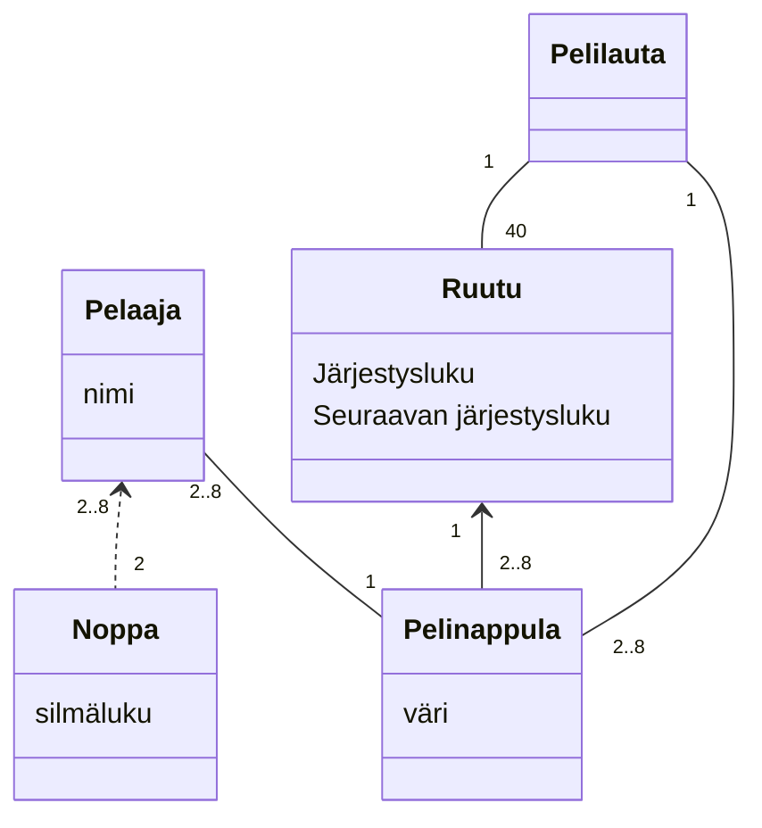
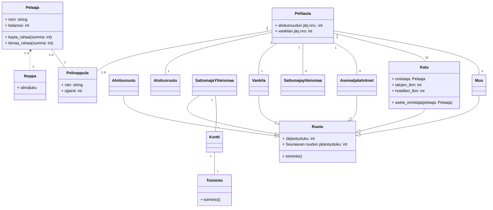
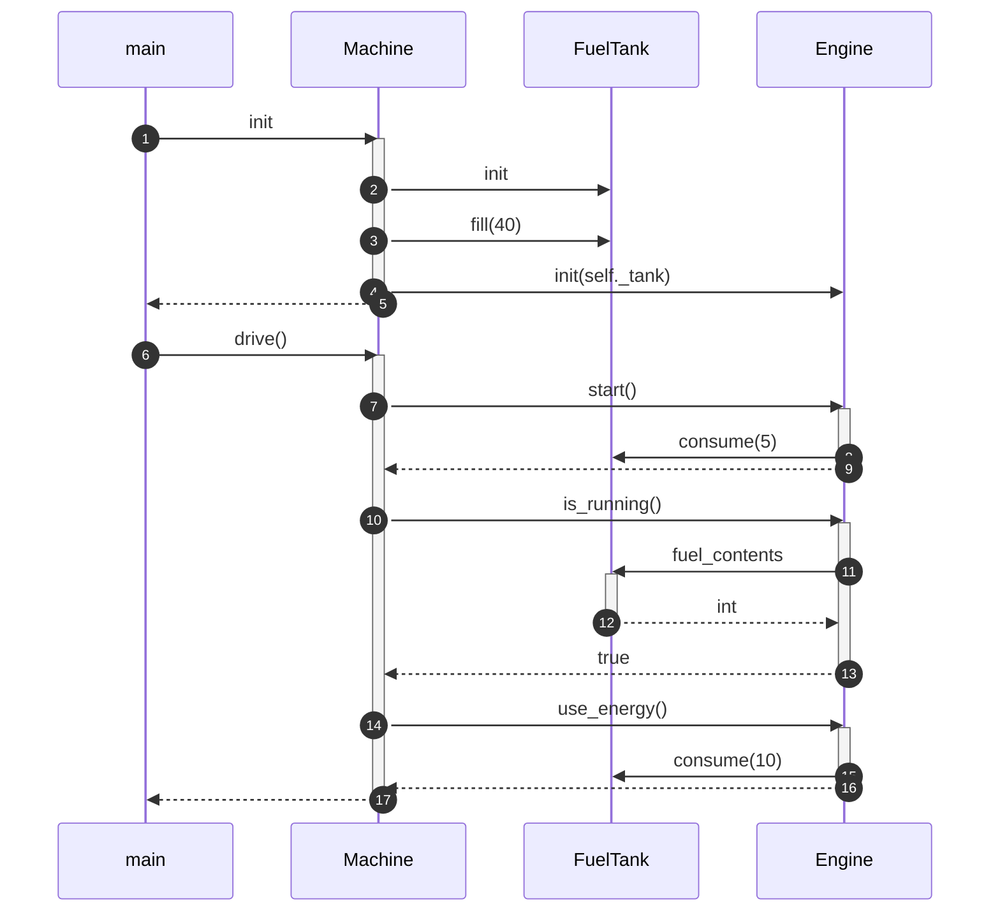
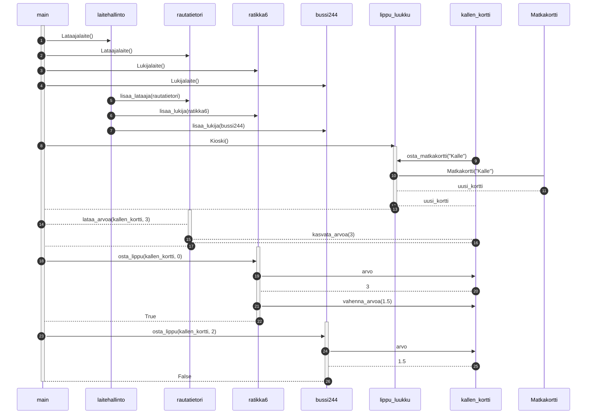

# Monopolin UML-mallinnus #

## Tehtävä 1 ##

### Vaatimukset ##
Monopolia pelataan käyttäen kahta noppaa. Pelaajia on vähintään 2 ja enintään 8. Peliä pelataan pelilaudalla joita on yksi. Pelilauta sisältää 40 ruutua. Kukin ruutu tietää, mikä on sitä seuraava ruutu pelilaudalla. Kullakin pelaajalla on yksi pelinappula. Pelinappula sijaitsee aina yhdessä ruudussa.

- [x] Noppa x2
- [x] Pelaajia 2 - 8
- [x] 40 ruutua
- [x] Jokainen ruutu tietää mikä on sitä seuraava ruutu (Katso huomiot tehtävän alla)
- [x] Pelinappula, yksi per pelaaja, pelinappula on aina ruudussa

## Tehtävä 2 ##

### Vaatimukset ###

Aloitusruutu 1
Vankila 1
Sattuma ja yhteismaa 6
Asemat ja laitokset 6
Normaalit kadut (joihin liittyy nimi) 22
Muut (2x ver, vapaa pysäköinti, mene vankilaan) 4
Monopolipelin täytyy tuntea sekä aloitusruudun että vankilan sijainti.

Jokaiseen ruutuun liittyy jokin toiminto.

Sattuma- ja yhteismaaruutuihin liittyy kortteja, joihin kuhunkin liittyy joku toiminto.

Toimintoja on useanlaisia. Ei ole vielä tarvetta tarkentaa toiminnon laatua.

Normaaleille kaduille voi rakentaa korkeintaan 4 taloa tai yhden hotellin. Kadun voi omistaa joku pelaajista. Pelaajilla on rahaa.

- [x] Tee luokasta ruutu abstrakti ruutu, jonka ominaisuudet periytyvät ym. listalle ruutuja (perintäsuhde)
- [x] Ruudulla on oltava toiminto, järjestysluku, tieto seuraavan ruudun luvusta
- [x] Tee luokka Kortti, jolla on aina attribuuttina luokan Toiminto instanssi
- [x] Kadun voi omistaa joku pelaaja
- [x] Kadulla sijaitsee 0 - 4 taloa tai yksi hotelli
- [x] Pelaaja-luokka on tilallinen: sillä on aina tietty määrä rahaa taskussa

# Sekvenssikaaviot #

## Tehtävä 3 ##

- [x] 1: Main-metodi luo Machine-instanssin
- [x] 2: Machine-instanssin konstruktori luo FuelTankin
- [x] 3: Kutsutaan luodun FuelTankin metodia fill arvolla 40
- [x] 4: Luodaan Engine-instanssi, jolle annetaan äsken luotu ja täytetty tankki
- [x] 5: Palautetaan kontrolli main-metodiin
- [x] 6: Kutsutaan Machinen metodia drive()
- [x] 7: Machine kutsuu luokan Engine metodia start() 
- [x] 8: Tämä trigeröi consumen FuelTankille arvolla 5
- [x] 9: Palautetaan kontrolli Machine-luokalle
- [x] 10: Machine kutsuu Engine-luokan metodia s_running()
- [x] 11: Engine tarkastaa FuelTankilta bensamäärän (fuel_contents)
- [x] 12: FuelTank palauttaa attribuutin fuel_contents arvon kokonaislukuna
- [x] 13: Engine evaluoi palautuksesta onko tankissa yli 0l. Jos (ja tässä tapauksessa kun) ehto on tosi, palautetaan arvo true
- [x] 14: Machine kutsuu Enginen metodia use_energy()
- [x] 15: Engine kutsuu FuelTankin metodia consume arvolla 10
- [x] 16: Engine palauttaa kontrollin Machinelle
- [x] 17: Machine palauttaa kontrollin main-metodille, johon ohjelma päättyy

## Tehtävä 4 ##

